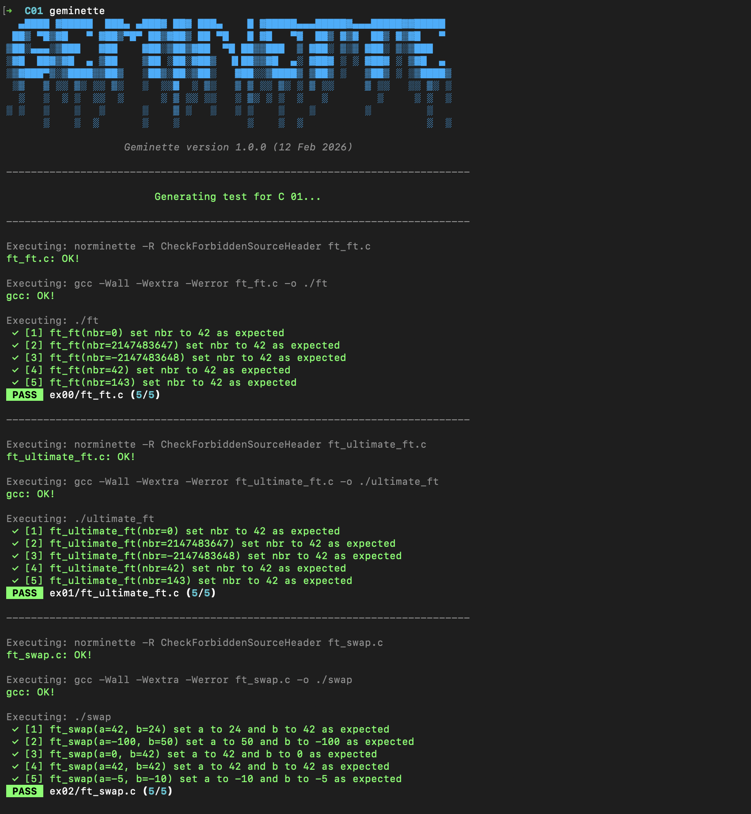
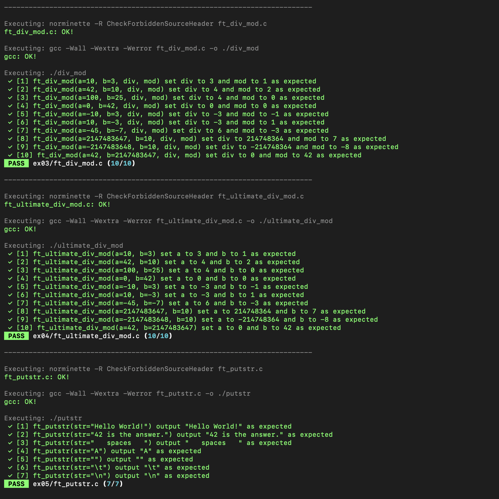
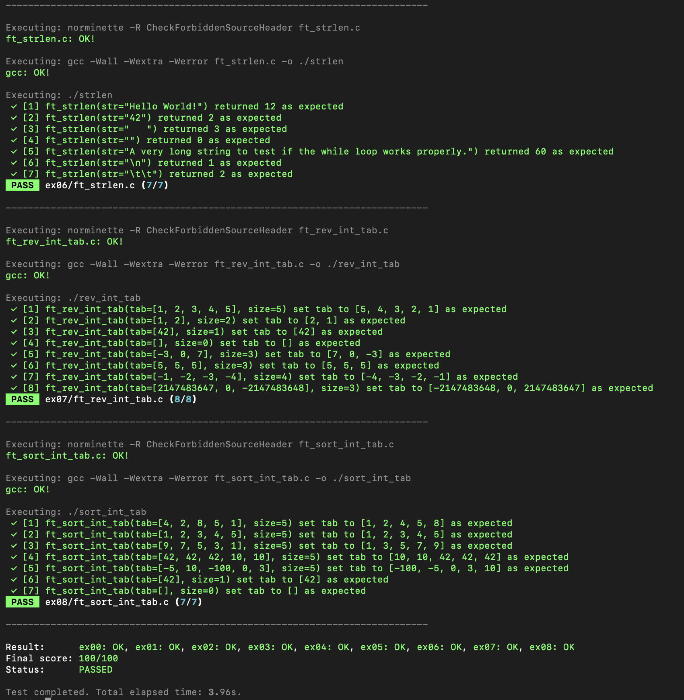
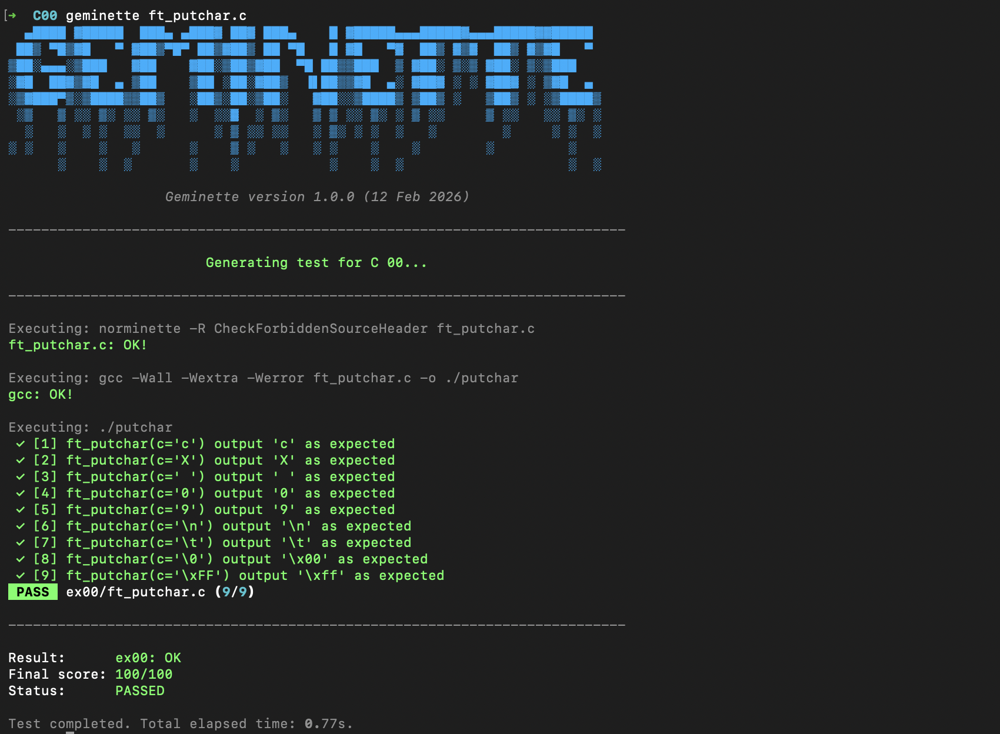
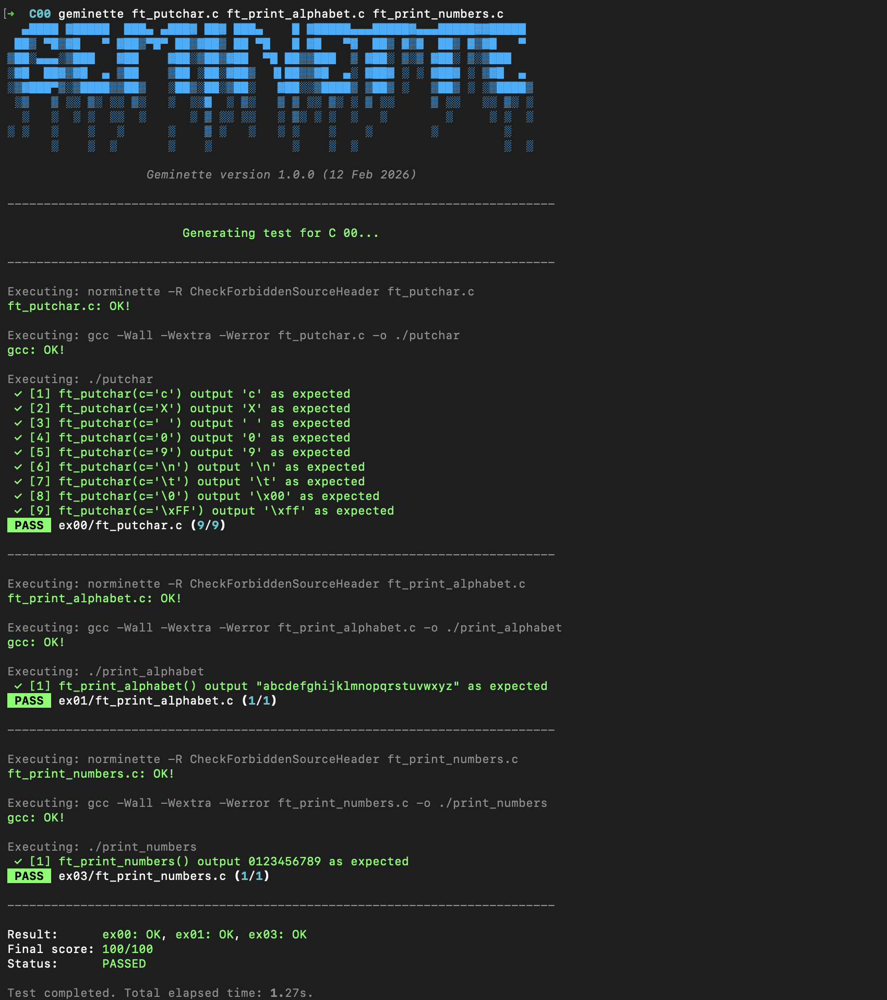

# Geminette
**Geminette** is a professional-grade, custom-built CLI testing framework designed specifically for the **42 School Piscine** C modules.

Built in Python, it acts as a local "Moulinette," automatically compiling student C files against hidden test harnesses, checking for strict Norminette compliance, and executing edge-case logic tests with a beautiful, standardized terminal UI.

## Features
* **Dynamic Targeting:** Test an entire module, a single exercise, or a specific C file directly from the command line.
* **Pixel-Perfect UI:** Utilizes the `rich` library for a gorgeous terminal interface. It intelligently handles raw integers, C-style characters, and strings, fully exposing hidden characters (like `\n` or `\t`) without breaking formatting.
* **Bulletproof Sandboxing:** C programs are compiled and executed in isolated subprocesses. Infinite loops or segmentation faults are safely caught without crashing the framework.
* **Strict Norminette Integration:** Automatically runs `norminette -R CheckForbiddenSourceHeader` before compilation to ensure 100% 42-compliance.
* **Dynamic Scoring:** Calculates a final score out of 100 based on the exact batch of files you targeted.

## Supported Modules
Currently, Geminette includes comprehensive test suites for the following Piscine modules:
- [x] **C 00** (Basic variables, loops, and printing)
- [x] **C 01** (Pointers, arrays, and basic algorithms)
- [ ] **C 02** *(In development)*

## Prerequisites
To run Geminette, your environment must have a few standard tools installed. Since 42 environments are typically macOS or Linux, here is how to get everything you need:

**1. GCC (C Compiler) & Git**
*(Usually pre-installed on 42 iMacs. If you are on a personal Mac, install Xcode Command Line Tools)*:
```bash
xcode-select --install
```

**2. Python 3.x**
(Pre-installed on macOS/Linux. Verify with `python3 --version`)

**3. Python Dependencies (Norminette & Rich)**
```bash
sudo apt update
sudo apt install python3-setuptools python3-rich
sudo apt install pipx
pipx install norminette
pipx ensurepath
```
## How to Install
Clone the repository directly into your home directory so it can be easily accessed from any module folder:
```bash
git clone [https://github.com/rabeloivan/Geminette.git](https://github.com/rabeloivan/Geminette.git) ~/Geminette
````

## How to Create an Alias
To make testing as fast as possible, you shouldn't have to type the full Python path every time. Create a global alias so you can just type `geminette` from any folder.

**1. Open your shell configuration file and add the alias**
* For zsh:
```bash
echo "alias geminette='python3 ~/Geminette/main.py'" >> ~/.zshrc && source ~/.zshrc
```

* For bash:
```bash
echo "alias geminette='python3 ~/Geminette/main.py'" >> ~/.bashrc && source ~/.bashrc
```

## Usage Examples

### Test an entire module
Navigate to your active module directory and simply call the framework:
```bash
➜  C01 geminette
```




### Test a specific exercise
You can target a single exercise by passing either the folder name or the file name:
```bash
➜  C00 geminette ex00
```
```bash
➜  C00 geminette ft_putchar.c
```


### Test more than one specific file:
```bash
➜  geminette ft_putchar.c ft_print_alphabet.c ft_print_numbers.c
```


## How to Update Geminette
Whenever new modules (like C02, C03, etc.) are added to the framework, you can easily pull the latest updates from GitHub.

Run this command from anywhere in your terminal:
```bash
cd ~/Geminette && git pull && cd -
```

## Inspiration & Acknowledgements
Geminette was heavily inspired by the incredible tools built by the 42 community before it—specifically [Francinette](https://github.com/xicodomingues/francinette) and Mini [Moulinette](https://github.com/k11q/mini-moulinette). This project aims to carry on their legacy of helping students rigorously test their code, while introducing a modern, fast, and highly customizable Python-based architecture.

## Authors
* Ivan Rabelo (rabeloivan) student at 42 - Creator & Lead Architect
* Gemini 3.1 Pro - Co-Architect

## Contributors
Contributions, issues, and feature requests are welcome! Feel free to check the issues page if you want to contribute to the test harnesses or framework core.

## License
This project is licensed under the MIT license. See the `LICENSE` file for details.